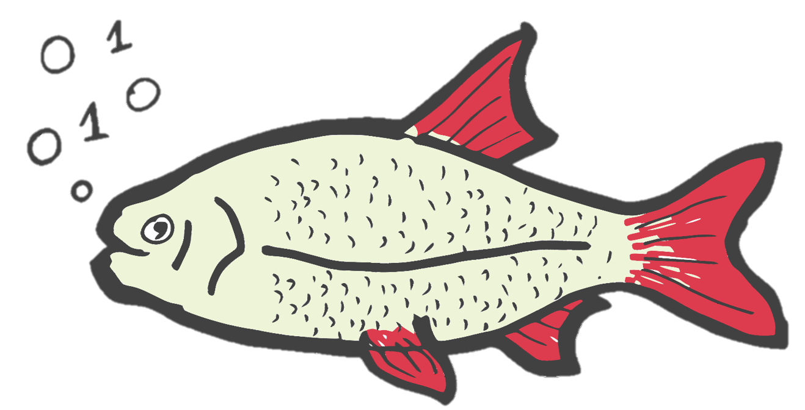

<!-- PROJECT LOGO -->
<br />

<p align="center">
  <a href="https://github.com/dalzilio/rudd">
    
  </a>
</p>

# RuDD [](https://goreportcard.com/report/github.com/dalzilio/rudd) [](https://godoc.org/github.com/dalzilio/rudd) [](https://github.com/dalzilio/rudd/releases)

RuDD is a library for Binary Decision Diagrams written in pure Go.

## About

RuDD is a Binary Decision Diagram (BDD) library written in pure Go, without the
need for CGo or any other dependencies. A [BDD](https://en.wikipedia.org/wiki/Binary_decision_diagram) is a data structure
used to efficiently represent Boolean functions or, equivalently, sets of
Boolean vectors.

It has nothing to do with Behaviour Driven Development testing!

## Specific use of Go build tags

We provide two possible implementations for BDD that can be selected using build
tags. The rationale for this unorthodox use of build tags is to avoid the use of
interfaces, and therefore dynamic dispatch, as well as to favor some automatic
compiler optimizations (such as code inlining).

Our default implementation (without any build tags) use a standard Go runtime
hashmap to encode a "unicity table".

When building your executable with the build tag `buddy` (as in `go build -tags
buddy mycmd`) the API will switch to an implementation that is very close to the
one of the BuDDy library; based on a specialized data-structure that mix a
dynamic array with a hash table.

To get access to better statistics about caches and garbage collection, as well as to unlock logging of some operations, you can also compile your executable with the build tag `debug`. 

## Relation with BuDDy and MuDDy

For the most part, RuDD is a direct translation in Go of the
[BuDDy](http://buddy.sourceforge.net/manual/) C-library developed by Jorn
Lind-Nielsen. You can find a high-level description of the algorithms and
data-structures used in this project by looking at ["An Introduction To Binary
Decision Diagrams"](https://www.cs.utexas.edu/~isil/cs389L/bdd.pdf), a Research
Report also distributed as part of the BuDDy distribution. The adaptation was
made easy by the simplicity of its architecture  (in a good sense) and the
legibility of its code.

In many places, the code of RuDD is an almost line-by-line copy of BuDDy
(including reusing part of the same comments for documenting the code), with a
few adaptations to follow some of Go best practices; we even implement the same
examples than in the BuDDy distribution for benchmarks and regression testing.

BuDDy is a mature software library, that has been used on several projects, with
performances on par with more complex libraries, such as
[CUDD](https://davidkebo.com/cudd). You can find a comparative study of the
performances for several BDD libraries in
[\[DHJ+2015\]](https://www.tvandijk.nl/pdf/2015setta.pdf).

Like with [MuDDy](https://github.com/kfl/muddy), a ML interface to BuDDy, we
piggyback on the garbage collection mechanism offered by our host language. We
take care of BDD resizing and memory management directly in the library, but
*external* references to BDD nodes made by user code are automatically managed
by the Go runtime. Unlike MuDDy, we do not provide an interface, but a genuine
reimplementation of BuDDy. As a consequence, we do not suffer from FFI overheads
when calling from Go into C, which is one of the major pain points of working
with Go.  

Experiences have shown that there is no significant loss of performance when
using BuDDy from a functional language with garbage collection, compared to
using C or C++
[\[L09\]](https://link.springer.com/content/pdf/10.1007%2F978-3-642-03034-5_3.pdf).
For example, we use MuDDy in the tedd model-checker provided with
[Tina](http://projects.laas.fr/tina/) (together with other libraries for dealing
with multi-valued decision diagrams). One of our motivations in this project is
to see whether we can replicate this experience in Go. Our first experiments
show very promising results, but we are still lacking a serious study of the
performances of our library.

## Installation

```
go get github.com/dalzilio/rudd
```

## Overview

The main goal of RuDD is to test the performances of a lightweight BDD library
directly implemented in Go, with a focus on implementing symbolic model-checking
tools. At the moment, we provide only a subset of the functionalities defined in
BuDDy, which is enough for our goals. In particular, we do not provide any
method for the dynamic reordering of variables. We also lack support for Finite
Domain Blocks (`fdd`) and Boolean Vectors (`bvec`).

In the future, we plan to add new features to RuDD and to optimize some of its
internals. For instance with  better  caching strategies or with the use of
concurrency features. It means that the API could evolve in future releases but
that no functions should disappear or change significantly.

## Why this name

The library is named after a fresh water fish, the [common
rudd](https://en.wikipedia.org/wiki/Common_rudd) (*Scardinius
erythrophthalmus*), or "gardon rouge" in French, that is stronger and more
resistant that the common roach, with which it is often confused. While it is
sometimes used as bait, its commercial interest is minor. This is certainly a
fitting description for our code ! It is also a valid English word ending with
DD, which is enough to justify our choice.

## References

You may have a look at the documentation for BuDDy (and MuDDy) to get a good
understanding of how the library can be used.

* [\[An97\]](https://www.cs.utexas.edu/~isil/cs389L/bdd.pdf) Henrik Reif
  Andersen. *An Introduction to Binary Decision Diagrams*. Lecture Notes for a
  course on Advanced Algorithms. Technical University of Denmark. 1997.

* [\[L09\]](https://link.springer.com/content/pdf/10.1007%2F978-3-642-03034-5_3.pdf)
  Ken Friis Larsen. [*A MuDDy Experience -– ML Bindings to a BDD
  Library*](https://link.springer.com/chapter/10.1007/978-3-642-03034-5_3)."
  IFIP Working Conference on Domain-Specific Languages. Springer,
  2009.

* [\[DHJ+2015\]](https://www.tvandijk.nl/pdf/2015setta.pdf) Tom van Dijk et al.
  *A comparative study of BDD packages for probabilistic symbolic model
  checking.* International Symposium on Dependable Software Engineering:
  Theories, Tools, and Applications. Springer, 2015.

## Usage

You can find several examples in the `*_test.go` files. 

To get access to better statistics about caches and garbage collection, as well
as to unlock logging of some operations, you can compile your executable with
the build tag `debug`, for instance with a directive such as `go run -tags debug
mycmd`.

```go
package main

import (
  "github.com/dalzilio/rudd"
  "math/big"
)

func main() {
  // create a new BDD with 6 variables, 10 000 nodes and a cache size of 5 000 (initially),
  // with an implementation based on the BuDDY approach
  bdd := rudd.New(6, Nodesize(10000), Cachesize(5000))
  // n1 == x2 & x3 & x5
  n1 := bdd.Makeset([]int{2, 3, 5})
  // n2 == x1 | !x3 | x4
  n2 := bdd.Or(bdd.Ithvar(1), bdd.NIthvar(3), bdd.Ithvar(4))
  // n3 == ∃ x2,x3,x5 . (n2 & x3)
  n3 := bdd.AndExist(n1, n2, bdd.Ithvar(3))
  // you can export a BDD in Graphviz's DOT format
  fmt.Printf("Number of sat. assignments: %s\n", bdd.Satcount(n3))
  fmt.Println(bdd.Stats())
  bdd.Dot(os.Stdout)
}
```

## Dependencies

The library has no dependencies outside of the standard Go library. It uses Go
modules and has been tested with Go 1.16.

## License

This software is distributed under the [MIT
License](https://opensource.org/licenses/MIT). A copy of the license agreement
is found in the [LICENSE](./LICENSE.md) file.

The original C code for BuDDy was released under a very permissive license that
is included in the accompanying [NOTICE](./NOTICE) file, together with a list of
the original authors. While the current implementation of RuDD adds some
original work, I expect every redistribution to include the present NOTICE and
acknowledge that some source files and examples have been copied and adapted
from the **BuDDy** Binary Decision Diagrams Library, Package v2.4, Copyright (C)
1996-2002 by Jorn Lind-Nielsen (see <http://buddy.sourceforge.net/>).

## Authors

* **Silvano DAL ZILIO** -  [LAAS/CNRS](https://www.laas.fr/)